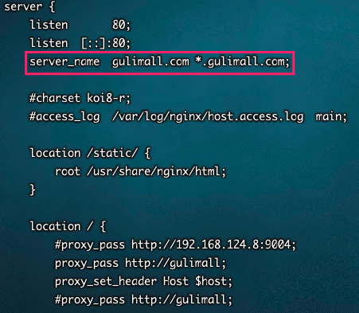

## `gulimall-Search`前端工程

> 与`gulimall-Product`一样，动静分离。将静态文件拷贝到nginx html/search下。修改search.html中静态资源路径

1. 整合 Thymeleaf 依赖包

	```xml
	<!-- Thymeleaf -->
	<dependency>
	  <groupId>org.springframework.boot</groupId>
	  <artifactId>spring-boot-starter-thymeleaf</artifactId>
	</dependency>
	<dependency>
	  <groupId>org.springframework.boot</groupId>
	  <artifactId>spring-boot-devtools</artifactId>
	</dependency>
	```

2. Index.html 放入 `gulimall-Search` templates下

3. 修改 search.html 标题头

	```html
	<html lang="en" xmlns:th="http://www.thymeleaf.org">
	```

4. 修改静态资源路径

	

	


## `gulimall-Search`域名环境

`引言:`

​	之前我们在弄首页 即 `gulimall-Product`的时候添加了域名 gulimall.com，如果访问该域名则直接跳转到首页或者使用`gulimall-Product`服务进行处理。

我们的出发点是每个微服务作为一个独立的系统可以实现分布式部署。并且支持集群部署，要想实现上诉两个要求则必须满足：

* 每个微服务都需要一套 域名环境，实现独立访问。
* 每个微服务都需要动静分离，实现一个前台，后台集群。并在网关或者nginx中 配置负载均衡


`流程:`

1. 添加本地域名映射

	```bash
	192.168.125.3    gulimall.com
	192.168.125.3    search.gulimall.com
	```

2. 修改nginx 反向代理  -- 处理 search.gulimall.com

	 

3. 网关将动态请求转发给 search服务

	```yaml
	        - id: gulimall_search_route # 域名映射
	          uri: lb://gulimall-Search
	          predicates:
	            - Host=search.gulimall.com  #search.gulimall.com域名下所有的请求
	
	        - id: gulimall_host_route # 域名映射
	          uri: lb://gulimall-Product
	          predicates:
	            - Host=**.gulimall.com  #gulimall.com域名下所有的请求
	```

	> 放在最后。


## ES搜索

`引言:`

​	上面我们搭建好了环境，现在有两个前端子项目，分别为【index.html 、search.html】其中index.html 负责显示首页等信息。search.html负责ES搜索


`流程:`

1. 构建VO实体类：结果解析VO、页面多种查询条件参数VO
2. 根据页面查询参数动态构建 ES -- DSL查询语句
3. 将结果信息进行解析 封装到 VO


