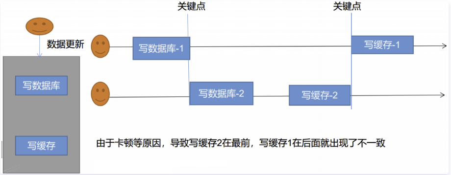
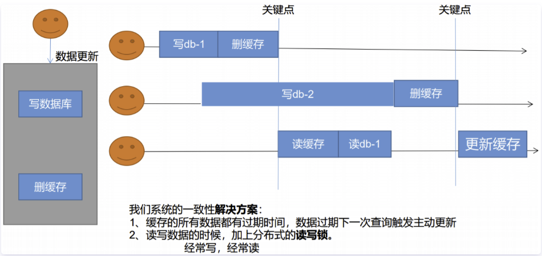
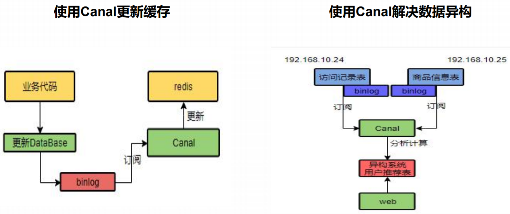

`引言:`

​	上一章中，分布式项目中我们使用了缓存【本地缓存、分布式缓存】，提高了接口的吞吐量。但随之引来的就是Redis在   高并发   的情况下三大问题

* 缓存穿透  存入null值+短期时间  解决
* 缓存雪崩  key 使用基本时间加随机时间  作为过期时间 解决
* 缓存击穿  热点key 失效时  高并发下使用加锁【本地锁、分布式锁】操作

> 并且在分布式锁的情况下得到了最优解，但是分布式锁达到最优解需要繁琐的操作和缜密的信息。比如 加锁、解锁 都需要原子操作【加锁+过期时间需要原子操作：防止死锁】【解锁+判定是否是自己的锁：防止本线程业务代码超时大于锁过期时间导致解锁了别的线程刚抢到的锁】【解锁+判定是否是自己的锁原子操作：防止在解除自己锁的网络路上锁过期 =》使用lua+redis实现】。


`麻烦:`

​	走到了加锁和解锁原子操作这一步，在分布式情况下使用Redis锁操作已经完美了，但是很是麻烦，加锁解锁都需要原子操作，并且解锁还需要使用lua脚本去实现。

`解决:`

​	Redisson分布式锁框架 ：本质上和jedis 、Lettuce一样都是操作Redis的中间件，但是Redisson强的地方就在于，它有很多的操作Redis的特性，最重要的是提供了分布式锁的实现【基于Redis】


## SpringBoot 整合 Redisson

> Redisson提供了 redisson-spring-boot-starter  为了弄清楚 Redisson 使用原声版的，一步一步配置。这里任然以 `gulimall-Product`演示


1. 导包

	```xml
	<!-- 分布式锁框架 -->
	<dependency>
	  <groupId>org.redisson</groupId>
	  <artifactId>redisson</artifactId>
	  <version>3.12.0</version>
	</dependency>
	```

2. 配置

	```java
	/**
	 * TODO:<p>  <p/>
	 * @package: com.shuai.gulimall.product.config
	 * @Author mac
	 * @Date 2021/3/17 8:18 下午
	 * @Version V1.0
	 **/
	@Configuration
	public class MyRedisConfig {
	
	    @Bean(destroyMethod="shutdown")
	    RedissonClient redisson() throws IOException {
	        /* 集群模式 官网 https://github.com/redisson/redisson/wiki/14.-第三方框架整合*/
	//        Config config = new Config();
	//        config.useClusterServers()
	//                .addNodeAddress("127.0.0.1:7004", "127.0.0.1:7001");
	//        return Redisson.create(config);
	        /*单体*/
	        //todo 1. 创建配置  安全协议
	        Config config = new Config();
	        config.useSingleServer().setAddress("redis://192.168.124.3:6379");
	        //todo 2. 根据config创建出RedissonClient示例
	        RedissonClient redissonClient = Redisson.create(config);
	        return redissonClient;
	    }
	}
	```

3. 测试

	```java
	@RunWith(SpringRunner.class)
	@SpringBootTest
	public class Client {
	
	    @Autowired
	    RedissonClient redissonClient;
	    @Test
	    public void testRedisCli(){
	        System.out.println(redissonClient.toString());
	    }
	}
	```


4. 示例

	```java
	@GetMapping("/hello")
	@ResponseBody
	public String sayHello(){
	  // todo 1. 获取一把锁，只要锁名字一样就是同一把锁，并且能锁住分布式下所有的线程
	  RLock lock = redissonClient.getLock("my-lock");
	  // todo 2. 加锁默认30s  阻塞等待  并不用担心原子操作、死锁问题。
	  // 自动续期：之前我们为了防止解锁时 业务超长执行以及在释放锁前断电灯导致的 死锁
	  //    和  解除其他线程的锁 的问题  在redisson中加入了自动续期，即业务方法执行
	  //    期间锁在快过期的时候自动加30s知道业务执行完，并且断电这种操作也会被释放锁
	  lock.lock();
	  //执行业务代码
	  try {
	    System.out.println("加锁成功。执行业务代码"+Thread.currentThread().getName());
	    Thread.sleep(30000);
	  }catch (Exception e){
	    e.printStackTrace();
	  }finally {
	    //todo 3. 解锁  再也不用担心解除其他人的锁以及原子操作等问题
	    System.out.println("释放锁 ~~~"+Thread.currentThread().getName());
	    lock.unlock();
	  }
	
	  return "请求  -->  nginx  -->  网关  -->  sayHello";
	}
	```

	> ```java
	> //指定时间 不会有看门狗去自动续期
	> lock.lock(10, TimeUnit.SECONDS);
	> ```


5. 之前的业务代码 优化   清爽 ~~

	```java
	//使用Redisson 解决Redis击穿 - - 分布式锁的问题
	public Map<String, List<Category2Vo>> getCategoryJsonFromDbWithRedisson() throws InterruptedException {
	    //获取锁
	    RLock rLock = redissonClient.getLock("category-lock");
	    rLock.lock();
	    Map<String, List<Category2Vo>> json ;
	    try {
	      //todo 首先查看缓存中是否有，有则返回没有则查库
	      String categoryJson = stringRedisTemplate.opsForValue().get("categoryJson");
	      if (!StringUtils.isEmpty(categoryJson)){
	        //todo 缓存中有值则直接返回
	        Map<String, List<Category2Vo>> restult = JSON.parseObject(categoryJson, new TypeReference<Map<String, List<Category2Vo>>>() {});
	        return restult;
	      }
	      List<CategoryEntity> allCategory = this.baseMapper.selectList(null);
	      // todo 缓存中没有则从DB中获取
	      json = findCategoryJson(allCategory, 0L);
	    }finally {
	      rLock.unlock();
	    }
	    return json;
	}
	```

	


## Redisson 各种锁

> 官网：https://github.com/redisson/redisson/wiki/8.-%E5%88%86%E5%B8%83%E5%BC%8F%E9%94%81%E5%92%8C%E5%90%8C%E6%AD%A5%E5%99%A8


### 可重入锁（Reentrant Lock）


### 公平锁（Fair Lock）


###  联锁（MultiLock）


### 红锁（RedLock）


### 读写锁（ReadWriteLock）

> 保证一定能读取到最新数据，修改期间，写锁是一个【排它锁、互斥锁】即多个线程同时写的时候互斥，只能有一个操作。读锁是一个共享锁。因为读并不会引发多线程安全问题。

根据读操作和写操作先后执行 共分为四种情况

* 读+读  相当于无锁，并发读。
* 写+读  等待写锁释放后再去读
* 写+写  阻塞方式
* 读+写  有读锁，写也需要等待

> 只要有写锁，都需要等待


### 信号量（Semaphore）

> 类似于停车位   车停满了 则等待车位。没有停满则可入库

1. 设定 一个 车位值
2. 来一个车辆  车位值  减一   走掉一个加一
3. 如果车停满了，则等待


### 可过期性信号量（PermitExpirableSemaphore）


### 闭锁（CountDownLatch）

1. 确保一个计算不会执行，直到它所需要的资源被初始化
2. 确保一个服务不会开始，直到它依赖的其他服务都已经开始
3. 等待，直到活动的所有部分都为继续处理做好充分准备
4. 死锁检测，可以使用n个线程访问共享资源，在每次测试阶段的线程数目是不同的，并尝试产生死锁


## 缓存数据更新问题   --  缓存数据一致性

`引言:`

​	之前在二级三级菜单栏数据存入缓存的时候，就在想一个问题，如果数据库数据发生改变怎么办？ 目前有两种解决方法。


### 双写模式



> 高并发下，会出现脏写的问题。


### 失效模式




### 解决方案

**无论是双写模式还是失效模式，都会导致缓存的不一致问题。即多个实例同时更新会出事。怎么办？ **

1. 如果是用户纬度数据（订单数据、用户数据），这种并发几率非常小，不用考虑这个问题，缓存数据加 上过期时间，每隔一段时间触发读的主动更新即可

2. 如果是菜单，商品介绍等基础数据，也可以去使用==canal==订阅binlog的方式。 

3. 缓存数据+过期时间也足够解决大部分业务对于缓存的要求。 

4. 通过加锁保证并发读写，写写的时候按顺序排好队。读读无所谓。所以适合使用读写锁。（业务不关心 脏数据，允许临时脏数据可忽略）；

**总结：** 

  1. **我们能放入缓存的数据本就不应该是实时性、一致性要求超高的。所以缓存数据的时候加上过期时间，保 证每天拿到当前最新数据即可。**

  2. 我们不应该过度设计，增加系统的复杂性

  3. **遇到实时性、一致性要求高的数据，就应该查数据库，即使慢点。**

## 4、解决-Canal



> Canal 部署后，会伪装成数据的的从库，然后根据数据库的二进制更新日志binlog  读取更新的数据然后 我们可以写一定的业务逻辑后进行缓存处理。