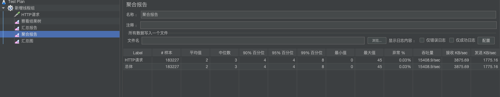
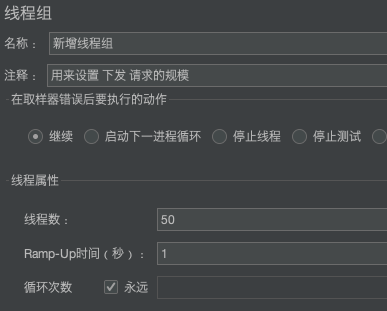

## 性能测试点

* 吞吐量  ： 每秒钟系统能够处理的请求书、任务数
* 响应时间  ： 服务处理一个请求和任务的耗时
* 错误率   ： 一批请求中结果出错的请求所占比例


## Jmeter压测工具

* Apache旗下
* 5.4.1 要求jdk8+


`使用流程 for mac`

1. http://jmeter.apache.org/download_jmeter.cgi 下载并解压缩

2. 进入apache-jmeter-5.4.1/bin/jmeter.sh   执行   **sh jmeter**

3. 新增  线程组 

	

	

	> 线程组 是用来 设置请求规模。比如上图：1s 之内创建200个线程去下发请求。并且循环200次，即总共创建了20000个请求 


4. 新增取样器--HTTP请求

	

	

	> http 请求  主要用来配置具体的http请求路径以及端口等信息，当然在路径那里还可以添加具体的请求


5. 添加 监听器 - 结果树|汇总报告|汇总图等

	

	

	> 这几个图都类似，可以查看请求后的数据   比如 上图中  样本  即20000个请求

6. 启动

	

	

	

7. 测试自己项目

	* 清空全部结果数据

	

	* 修改请求地址

	

	* 启动测试

	

	

	> 吞吐量 
	>
	> * 自己的首页接口为538kb/s   
	>
	> * 而百度的为3894kb/s  
	>
	> 响应时间
	>
	> * 自己的首页接口为 99%的请求都能够在614ms响应完成
	> * 而百度的为99%都能够在84ms响应完成


## 性能优化

`影响性能的点`

* 数据库
* 应用程序
* 中间件(tomcat、nginx、网关、nacos、feign、mybatis、redis等等)

`优化指标`

​	检查接口是属于 `IO密集型`还是`cpu密集型`

* `IO密集型` ：网络io、磁盘io、数据io 等。表现为磁盘占有率一直居高不下
	* 使用横向扩展多台服务器后者增加CPU处理器
* `cpu密集型` ：大量的计算、逻辑处理等。表现为cpu占有率一直居高不下
	* 固态硬盘、内存条、缓冲、更换网卡、线程处理


### JVM性能监控

有了性能监控，我们才能够更好地了解自己的程序整体情况，然后做出相应的处理。


> * 性能优化主要是针对 堆  的调优。监控也是主要针对此处进行重点关注
>
> * 共有两个GC  【YGC（新生代区GC）、FGC（老年代和新生代全部GC）】。FGC执行时间是YGC的10倍。因此调优时要重点检查FGC的次数


### JVM性能检测工具Jconsole 、jvisualvm

* Jconsole 性能可视化界面：可以实时查看堆内存、类、线程等相关信息

	

	

	> 依次为老年代、新生代-伊甸园区、新生代-幸存者区

* jvisualvm 性能可视化界面：功能比Jconsole更加的强大，提供了手动GC以及调优的功能，并且可以通过安装插件来实现更丰富的功能

	

	

	> 线程相关概念
	>
	> * 运行 ：正在运行的线程
	> * 休眠：sleep
	> * 等待：wait
	> * 驻留：线程池里面空闲的线程
	> * 监视：阻塞的线程、等待锁
	* 插件安装

		

		

		> 上图可以看到新生代曲线图按照一定的频率上升后骤降，因为达到新生代内存上线后做了GC因此内存占用清空了很多是很健康的图表。老年代是很平稳的。也很健康

### 单独测试nginx性能




```bash
docker stats
```


> 上图可知nginx 是CPU密集型。内存几乎都不动的。


### 单测试网关


> 没有进行压测前，新生代有规律的增长以及GC。老年代则基本保持不变。压测后新生代存入对象频率陡然增快，因为频率增快导致GC频率也增快，有一些大对象或者达到对象存货阈值的对象都存入老年代。从而导致老年代内存持续增加。虽然也有FGC但是效果并不怎么明显。左侧Old图可见。如果超出则会报超内存错误。


### 简单服务测试

> 发送一个请求 直接使用`gulimall-Product`处理

1. `gulimall-Product`新增一个接口

	```java
	package com.shuai.gulimall.product.web;
	@Controller
	public class IndexController {
	  @GetMapping("/hello")
	  @ResponseBody
	  public String sayHello(){
	    return "sayHello";
	  }
	}
	```

2. 压力测试

	

	

	

	

	

	

	> 总体情况与网关类似，两者都是SpringBoot项目区别在于处理的业务不一样以及网关是springboot+gateway的整合
	>
	> 高压测试下最终都会发生内存溢出情况。


### 简单服务测试  过网关

> 发送一个请求 直接到`网关` 然后在映射到`gulimall-Product`处理

1. `gulimall-Product`新增一个接口

	```java
	package com.shuai.gulimall.product.web;
	@Controller
	public class IndexController {
	  @GetMapping("/hello")
	  @ResponseBody
	  public String sayHello(){
	    return "请求  -->  网关  -->  sayHello";
	  }
	}
	```

2. 网关新增/hello映射

	```bash
	- id: product_router
		uri: lb://gulimall-Product
		predicates:
			- Path=/api/product/**,/hello
		filters:
			- RewritePath=/api/product(?<segment>/?.*), /$\{segment}
	```

3. 测试

	

	

	

	

	

	> 没什么好说了，和上面差不多，本来不打算贴最后两张图了，但是发现老年代内存区满了以后并不是直接报 超内存，而是先FGC后判定新创对象是否能放得下，能放得下则放，如果放不下再报超内存


### 简单服务(过nginx和网关)

> 发送一个请求  由`nginx`接受并反向代理给`网关` 然后在映射到`gulimall-Product`处理

1. 修改处理函数

	```java
	package com.shuai.gulimall.product.web;
	@Controller
	public class IndexController {
	  @GetMapping("/hello")
	  @ResponseBody
	  public String sayHello(){
	    return "请求  -->  nginx  -->  网关  -->  sayHello";
	  }
	}
	```

2. 测试

	

	

	

	

	

	> 这次不想上次那样 老年代会突然增加很多那种情况，在持续的稳定增加。因为服务经过了nginx和gateway 后吞吐量没那么大了

	


### 首页一级菜单栏压测

> 直接访问 `gulimall-Product` 去访问首页，这里会涉及到数据库的查询

1. 具体函数

	```java
	@GetMapping({"/","/index.html"})
	public String indexPage(Model model){
	  //todo 1.查出所有的一级分类
	  List<CategoryEntity> categoryEntities = categoryService.getLeave1Categorys();
	
	
	  model.addAttribute("categorys", categoryEntities);
	  //"classpath:/templates/";  ".html";
	  return "index";
	}
	```

2. 注释掉二级三级菜单栏访问

	```html
	<!--<script type="text/javascript" src="index/js/catalogLoader.js"></script>-->
	```

3. 测试

	

	

	

	

	

	> 这次 老年代出现了较高的波动，证明了我们上一个实验中结论，吞吐量变高后，老年代 存入对象的频率会爆长。


### 二级三级分类数据压测

1. 放开js

	```js
	<script type="text/javascript" src="index/js/catalogLoader.js"></script>
	```

2. 测试

	

	


### 新增页面渲染压测

> 之前都是针对 接口一级数据压测


> Tomcat分配的线程数去处理业务逻辑。如果加上静态资源的处理，则势必会挤占一些Tomcat线程。导致吞吐量进一步缩减


## Baidu、nginx、Tomcat、网关 性能比较

一秒创建200个线程循环100次。即共20000个请求。

| 技术                    | 样本      | 标准偏差 | 异常% | 吞吐量/S   | 最小值/ms | 最大值/ms | 平均值/ms | 95%百分位/ms | 99%百分位/ms | 接受KB/S   | 发送KB/S  |
| ----------------------- | --------- | -------- | ----- | ---------- | --------- | --------- | --------- | ------------ | ------------ | ---------- | --------- |
| 百度                    | 20000     | 21.044   | 0.56% | 3926.2     | 5         | 685       | 36        | 47           | 74           | 9,564.428  | 449.876   |
| nginx                   | 20000     | 3        | 0     | 13,717.421 | 0         | 57        | 3         | 8            | 14           | 3,442.081  | 1,580.718 |
| 网关                    | 1,098,726 | 4.116    | 1     | 2,763.18   | 0         | 356       | 4         | 8            | 17           | 815.188    | 315.701   |
| 简单服务(不过中间件)    | 1,829,868 | 5.188    | 0     | 22,373.307 | 0         | 796       | 1         | 3            | 5            | 4,539.513  | 2,709.194 |
| 简单服务(过网关)        | 323,829   | 10.479   | 0.02% | 4,549.694  | 0         | 211       | 9         | 28           | 53           | 1,116.751  | 541.971   |
| 简单服务(过nginx和网关) | 493,626   | 82.21    | 0.02% | 493.105    | 0         | 4985      | 16        | 27           | 58           | 128.7      | 58.737    |
| 首页以及菜单栏(过MySQL) | 115,451   | 32.761   | 0.04% | 1,087.396  | 3         | 307       | 39        | 106          | 158          | 28,316.107 | 126.313   |
| 二级三级菜单栏          | 17,102    | 65.50    | 0.29% | 317.327    | 3         | 602       | 142       | 267          | 319          | 19,945.258 | 42.331    |

> 网关：这里网关只负责请求转发。由springboot+tomcat+gateway整合，百分之百错误是因为请求为根路径。
>
> 简单服务：直接返回字符串。不经过nginx和网关，由springboot+tomcat整合。
>
> <font color=ff00aa>总体而言，简单服务性能优于网关，因为简单服务省掉了gateway处理</font>
>
> 简单服务(过网关)：因为要经过两个springboot项目 + gateway 因此整体响应演示增大。
>
> <font color=ff00aa>三个简单服务，随着增加的中间件越来越多，标准偏差、吞吐量、平均相应时间都在指数级下降。由此可知，多个中间件带来了网络IO加剧。可以提高带宽网线网卡来优化</font>
>
> 首页以及一级菜单栏(过MySQL)：过MySQL以后平均响应时间大大增加。
>
> 二级三级菜单栏：业务逻辑处理量增大。数据量增大
>
> <font color=ff00aa>一级数据和二级三级数据相比。业务处理量和数据量增大造成吞吐量、标准偏差、平均响应时间骤增</font>


`总结：`

* 中间件越多，性能损失越大，大都浪费在了中间件之间网络交互
* 设备层面：提高网络带宽、使用优质的网线网卡等设备
* 业务：DB（MySQL优化、查询字段新增索引）、模板的渲染速度（thymeleaf开启缓存等）、静态资源处理


`例如`

```java
baseMapper.selectList(new QueryWrapper<CategoryEntity>().eq("parent_cid", 0));
```

一级菜单栏查询数据根据 parent_cid查询。数据库中修改格式将此字段修改为索引(任意)


