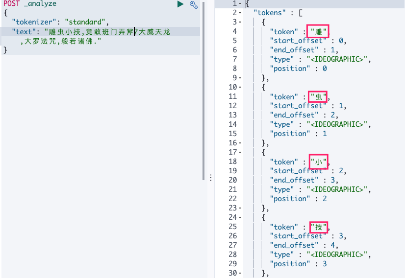
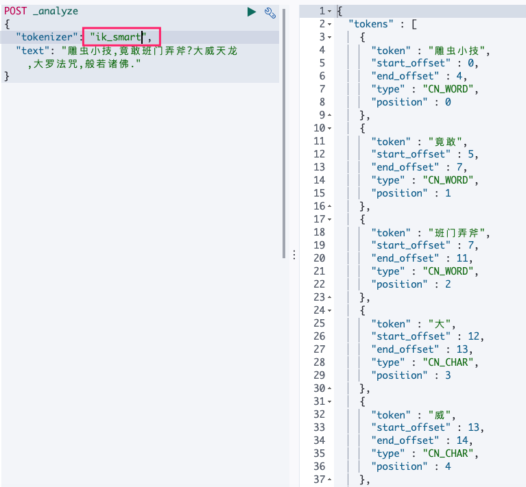
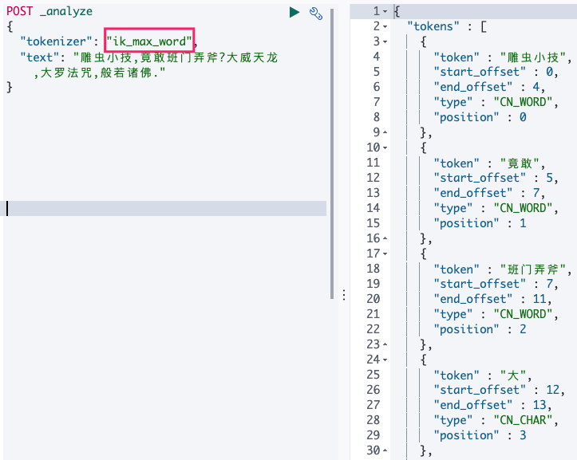
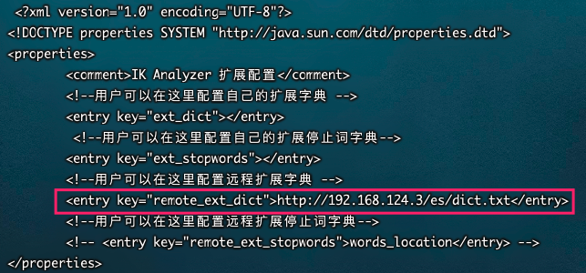

## 分词器

* 一个分词器接受一个字符流，将之分割为独立的词元(通常是独立的单词)，然后输出 词元流。

* ES中默认分词器只是针对于英文有较好。

	> ```console
	> POST _analyze
	> {
	>   "tokenizer": "standard",
	>   "text": "The 2 QUICK Brown-Foxes jumped over the lazy dog's bone."
	> }
	> ```
	>
	> ==>
	>
	> [ The, 2, QUICK, Brown, Foxes, jumped, over, the, lazy, dog's, bone ]



## 安装中文分词器

* GitHub下载对应版本的分词器：https://github.com/medcl/elasticsearch-analysis-ik/releases     

* 将下载好的压缩包放入docker-ES 数据卷 plugins目录中

* 修改分词器目录权限

	```bash
	chmod -R 777 ik/
	```

* 检验是否按照成功

	* 进入容器

		```bash
		docker exec -it es /bin/bash
		```

	* 使用elasticsearch-plugin查看已安装好的插件

		```bash
		cd /bin
		elasticsearch-plugin -h
		
		Commands
		--------
		list - Lists installed elasticsearch plugins
		install - Install a plugin
		remove - removes a plugin from Elasticsearch
		
		elasticsearch-plugin list
		```

	

	* 重启

		```bash
		docker restart es
		```

	

	* 测试

	

	

	  

	> 这里会将大威天龙分词四个字。。。


## 自定义词库

> 上面我们使用了ik分词器，发现效果并不是很好，网络热词并不能很好的分割。

`整体步骤:`

* docker-nginx部署词库静态项目
* docker-es访问nginx即可

> 没安装docker-nginx 可参考 ：MD-Book/Docker/第九章-Docker安装Nginx.md

`详细步骤`

* nginx添加词库

	```bash
	# 在html下新建es/dict.txt
	```

* 写入词语|也可网络查找全部写入

	```bash
	[root@localhost es]# cat dict.txt 
	雕虫小技
	班门弄斧
	大威天龙
	大罗法咒
	```

* 修改ck分词器配置

	```bash
	[root@localhost config]# pwd
	/root/elasticsearch/plugins/ik/config
	[root@localhost config]# vim IKAnalyzer.cfg.xml
	```




* 重启es并测试

