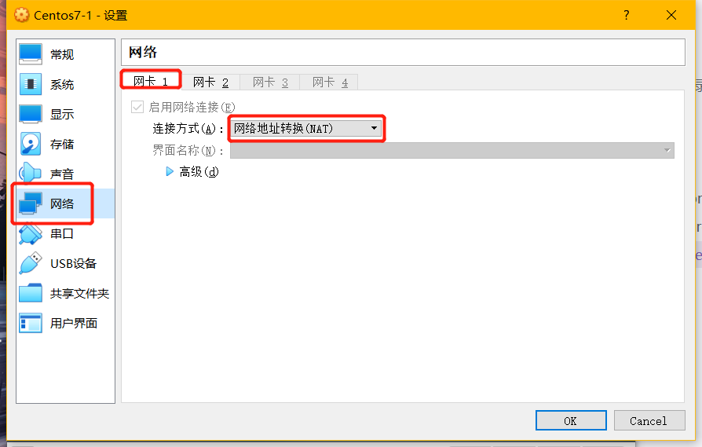
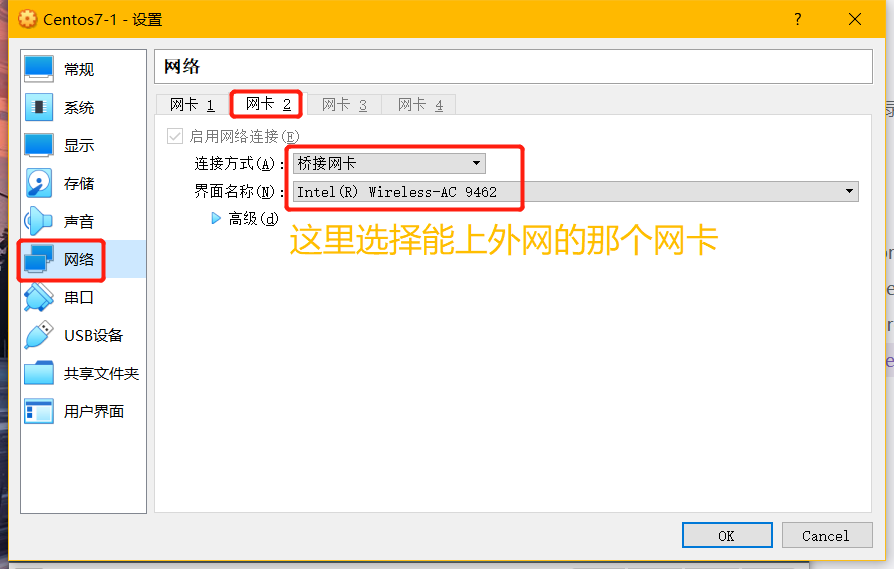
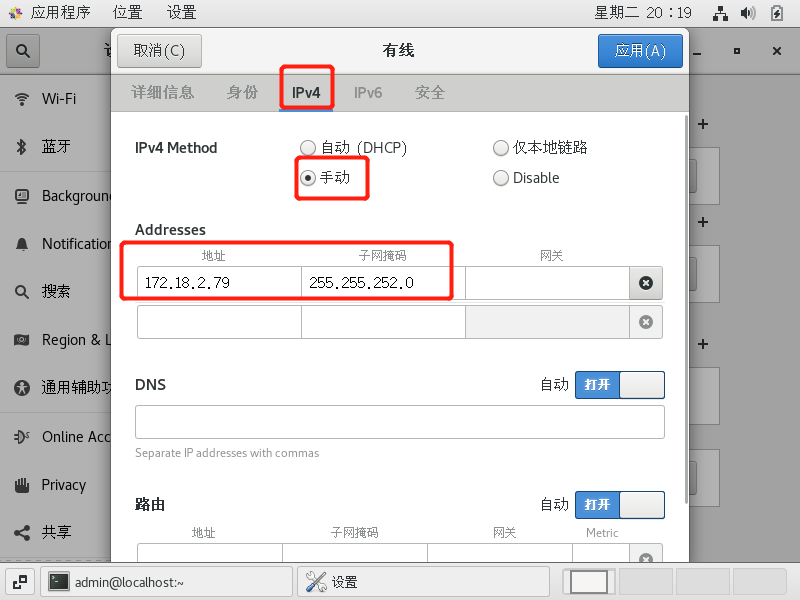
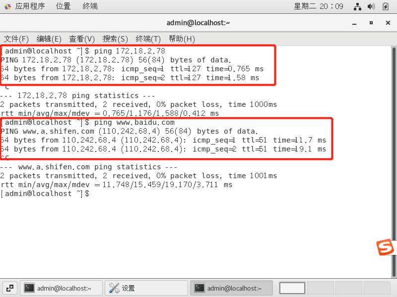
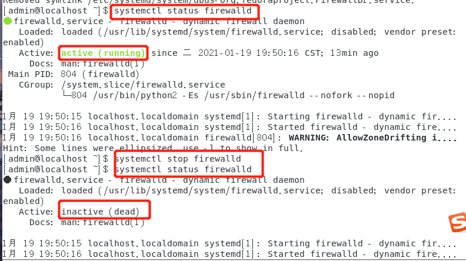
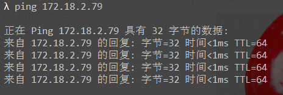
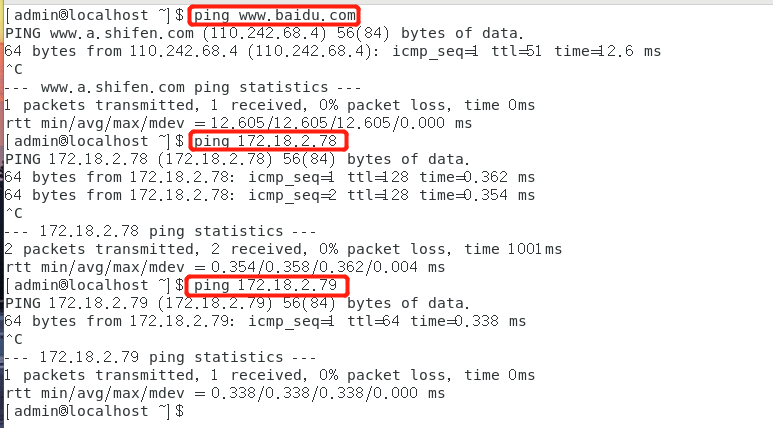

## centos7虚拟机网络设置

`效果:`

*   多台虚拟机之间互通
*   虚拟机和物理机互通
*   虚拟机访问外网


`网络背景:`

*   物理机IP(能访问外网的网卡IP)：172.18.2.78
*   物理机网关：172.18.0.1
*   物理机mask：255.255.252.0


`步骤:`

1.  VirtualBox设置双网卡

    

    

2.  虚拟机配置网卡

    *   NAT模式网卡无需修改：此网卡访问外网

    *   桥接模式：配置和物理机IP同网段IP即可。我这里配置为172.18.2.79

        

3.  虚拟机ping物理机

    

4.  物理机ping不通虚拟机

    *   关闭虚拟机防火墙

        ```bash
        systemctl status firewalld   --查看防火墙状态
        systemctl disable firewalld  --永久关闭防火墙
        systemctl stop firewalld     --暂时关闭防火墙
        systemctl enable firewalld   --重启防火墙 
        ```

        

    *   再次测试

        

        

5.  另外一台虚拟机如法炮制配置IP  172.18.2.80

    