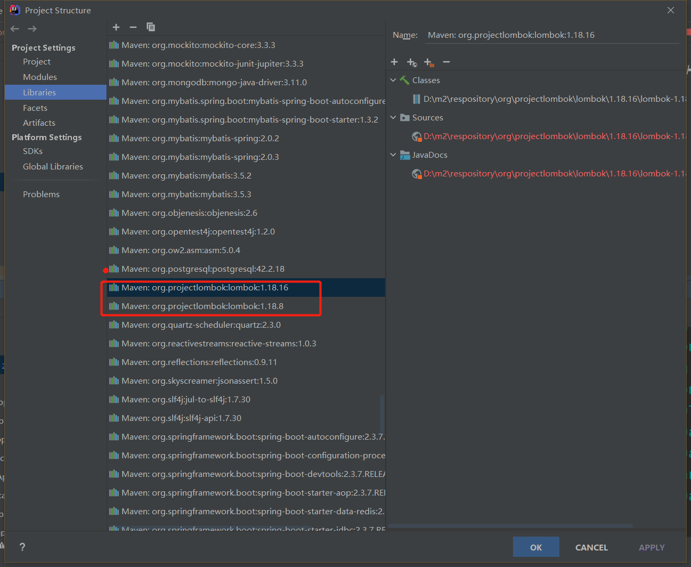

`问题`

如标题所示：突然间项目启动报错  找不到符号  而且都是set、get方法。因此断定是lombok的问题。

`解决`

按照网上一通搞都不行，冷静分析一波，既然是 lombok的问题，并且和插件以及插件版本和jar包版本都一致的前提下任然有问题，可能是jar包冲突问题，导致lombok失效。果然，

既然是多个jar包导致的冲突，那么只需要删除一个不就可以了。过程很气人，pom文件修改后，在Maven 依赖中任然存在很多个，头疼。搞了半个多小时。终于搞定了。

>   备份pom文件，删除后刷新依赖【这个时候idea会提示是否删除项目，一定不要】然后在还原回去重新加载即可。老特么费劲了。