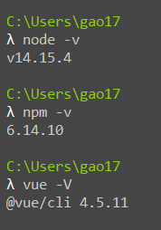

报错信息：

```bash
gyp ERR! stack Error: Can't find Python executable "D:\Python\python-3.7.0", you can set the PYTHON env variable.
```


我的环境：




原因：

>   不支持python3，只能按照python2


解决方法：

1.  设置Python版本为2

    ```bash
    npm config set python python2.7
    npm config set msvs_version 2015
    ```

2.  解决chromedriver依赖问题

    ```bash
    npm install --ignore-scripts
    ```

3.  执行npm install  报错

    ```bash
    Module build failed: Error: Node Sass does not yet support your current environment: OS X 64-bit wit
    ```

4.  node-sass 不适配当前node环境，重装

    ```bash
    npm uninstall --save node-sass  
    npm install --save node-sass
    ```

    