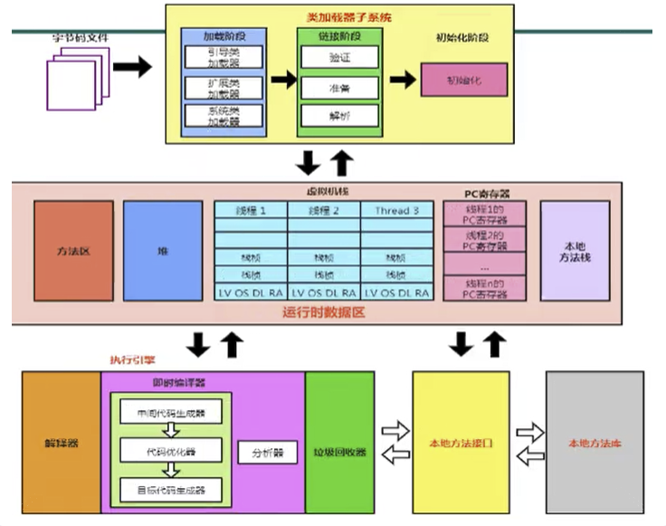

`引言:`

这个就涉及到了多线程的知识点。逐一说明


## 概念说明

* 并发和串行
* 创建线程的方式以及异步编排
* 线程的生命周期
* 公平锁和非公平锁
* 重入锁和不可重入锁
* Synchronized和Lock区别
* ~~锁机制流程~~
* 死锁
* 线程通信以及异步编排
* ~~多线程内存模型~~
* ~~原子性、可见性、有序性~~
* 多线程控制类（ThreadLocal、原子类、Lock类以及同步关键字Synchronized、Volatile）
* 同步类容器
* 并发类容器
* 线程池
* JMM JAVA内存模型
* JVM  Java虚拟机


## Volatile

> 是Java虚拟机提供的`轻量级`的`无锁同步机制`，不像synchronized和lock重量级锁，它们是有锁机制的

`特性:`

* 保证可见性
* 保证有序性（禁止指令重排）
* 不保证原子性即某个线程执行某个业务时，中间不可被加塞或者分割，需要整体完整性

`使用场景`

1. 一个线程去操作，剩余线程去读取
2. DCL 单例模式需要 new对象解除掉指令重排 即有序性


## 锁机制执行流程

1. 获得同步锁；

2. **清空工作内存；**

3. **从主内存拷贝对象副本到工作内存；**

4. 执行代码(计算或者输出等)；

5. **刷新主内存数据；**

6. 释放同步锁。

<font size=4 color=ffooff><code>所以，synchronized既保证了多线程的并发有序性，又保证了多线程的内存可见性。</code></font>

```java
class Test {
	static int i = 0, j = 0;
	static void one() {
		i++;
		j++;
	}
	static void two() {
		System.out.println("i=" + i + " j=" + j);
	}
}
```

>一些线程执行one方法，另一些线程执行two方法，two方法有可能打印出j比i大的值，按照之前分析的线程执行过程分析一下：

           1. 将变量i从主内存拷贝到工作内存；

           2. 改变i的值；

           3. 刷新主内存数据；

           4. 将变量j从主内存拷贝到工作内存；

           5. 改变j的值；

           6. 刷新主内存数据；

>这个时候执行two方法的线程先读取了主存i原来的值又读取了j改变后的值，这就导致了程序的输出不是我们预期的结果


## JMM (Java内存模型) 和jvm内存模型(运行时数据区)

* Java内存模型 一般指线程主内存和线程内存以及线程可见性原子性有序性  就CAS那一块

* jvm内存模型 一般指类加载以后,类的数据内容存储情况以及方法运行情况

	


> 由于JVM运行程序的实体是线程，而每个线程创建时JVM都会为其创建一个工作内存(栈空间)，工作内存是每个线程的私有数据区域，而Java内存模型中规定所有变量都存储在主内存中，主内存是共享区域，所有线程都可访问，`但线程对变量的操作（读取赋值等）必须在主内存中进行，首先要将变量从主内存拷贝到自己的工作内存(栈空间)，然后对变量进行操作，操作完成后再将变量写回主内存`，不能直接使用主内存中的变量，各个线程工作主内存存储着主内存变量副本拷贝，因此不同的线程无法访问对方的工作内存，线程间通讯必须通过主内存来完成。