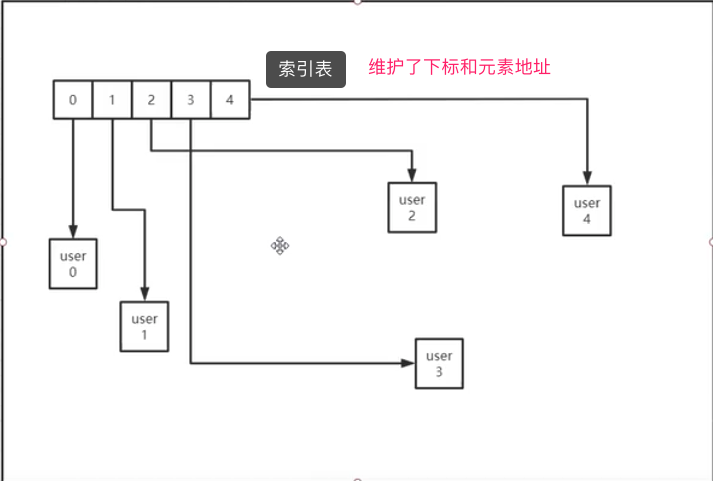
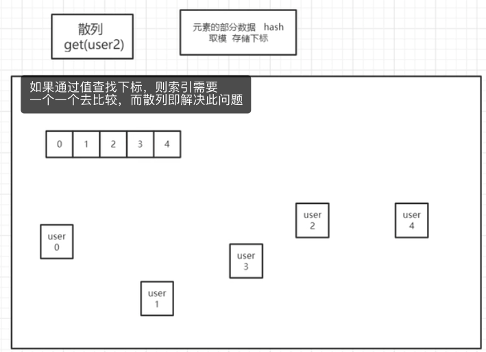

## Java SE

### 1、String、StringBuffer、StringBuild区别

* String

	长度不可变，每次都会在堆内存开辟空间，浪费大量内存，占用GC

* StringBuffer

	长度可变，因为其每个对象都带了一个缓存区，当长度超过即扩容，并且是线程安全，相较于StrngBuild速度会慢一点

* StringBuild

	长度可变，速度更快，但是线程不安全

> 经常看到 ”string+变量+string“   每加一次都会创建三个堆空间。因此用到字符串操作是尽量使用 后两个。 但是如果你仅仅是字符串拼接的话，jvm会将拼接按照StringBuffer来进行操作，如果你是字符串变量拼接则jvm并不会按照StringBuffer来操作。

### 2、集合框架

#### `数据结构`

* 顺序存储 -- 数组
	1. 固定长度固定类型初始化 为 null
	
		```java
		String[] att = new String[5];
		```
	
	2. 寻找一个完整的内存空间用以开辟
	
	3. 变量attr -> 栈空间存放第0号元素的地址
	
	4. 随机（下标）读取时 通过 head地址+N*每个元素固定长度   时间复杂度为O(1)
	
	> 不可插入删除：固定长度    随机读取快：head地址+N*元素长度 = 数组中元素内存地址 O(1)      内存申请要求严格

* 顺序存储 -- 动态数组

	1. 固定长度固定类型初始化 为 null

	2. 寻找一个完整的内存空间用以开辟

	3. 变量的栈空间存放第0号元素的地址

	4. 随机读取：通过 head地址+N*每个元素固定长度   时间复杂度为O(1)

	5. 随机插入：如果插入时数组长度已满 则 重新创建一个新的固定长度(根据扩容因子1倍或者1.5倍)的新数组，然后将之前数组内容进行拷贝。指定下标以及后面的所有元素后移一位，将制定下标位置腾出存入新的数据  时间复杂度为O(N)

	6. 随机删除：删除指定下标位置元素，后面的元素前移一位  时间复杂度为O(N)

	> 弥补 静态数组不可删除插入短板    内存申请严格 

* 链式存储 -- 单向链表

	1. 固定类型初始化 

		```java
		 List<String> list = new LinkedList<>();
		```

	2. 变量的栈空间存放第0号元素的地址

	3. 链表中存放了 Node 对象，其包含了如下属性

		```java
		E item;  // 链表中该节点值
		Node<E> next;  //链表中该节点关联下一节点的地址
		```

	4. 随机读取：获取到首地址，在依次获取下一个Node，直到获取到指定Node。时间复杂度为 O(N)

	5. 随机插入：将前一个元素Node中的next 指向该元素，再将该元素Node节点的next指向后一个元素    时间复杂度为O(1)

	> 随机读取慢，随机插入快，内存申请很宽松，利用碎片化地址即可。

* 链式存储 -- 双向链表

	1. 链表中存放了 Node 对象，其包含了如下属性

		```java
		 E item;
		Node<E> next;
		Node<E> prev;
		```

> 上面我们讲到的两个  数组  和  链表   都或多或少存在缺点     数据插入删除慢     链表读取慢   。有什么折中的方案吗？ 索引


* 索引

	

	1. 随机读取：读取索引表  对应  的内存地址即可   静态数据读取方式   时间复杂度O(1)
	2. 随机插入：新建Node，索引表中类似于动态数组进行后移并关联Node
	3. 随即删除：删除索引表中关系，删除Node

	> 需要额外空间存储索引关系

* 散列

	

	1. 存入元素时，将元素 hash 取模 得到数组(索引)下标值，进行存入
	2. 通过元素读取时，将元素 hash 取模 得到的下标值，通过数组读取到元素的内存地址即可

#### `容器`

* Collection

	> 装单个元素

	* List

		> 可重复，有序

		* Vector

			> 线程安全，依赖于操作容器的方法都加了synchronized，效率极低

		* ArrayList

			> 数组实现，查询快O(1)，删除插入慢O(n)  通过Collections.synchronizedList(new ArrayList<String>());获取线程安全的Arraylist

		* LinkList

			> 链表实现，查询慢O(n)，删除插入快O(1)  通过Collections.synchronizedList(new LinkedList<String>());获取线程安全的LinkedList

		* CopyOnWriteArrayList

			> 线程安全，适合读多写少。

	* Set

		> 不可重复,无序

		* HashSet

			> hash表实现，没有顺序

			* LinkedHashSet

				> 存入元素时使用链表进行存储，存入和读取的元素的顺序是一样的

		* SortedSet

			* TreeSet

				> 红黑树实现，可以进行排序

		* EnumSet

		* CopyOnWriteArraySet

	* Queue

		> 实现了队列，可以阻塞式，也可以是非阻塞式

* Map

	> 装成对元素

	* HashMap
	* TreeMap
	* WeakHashMap
	* IdentityHashMap
	* ConcurrentHashMap
	* ConcurrentSkipListMap